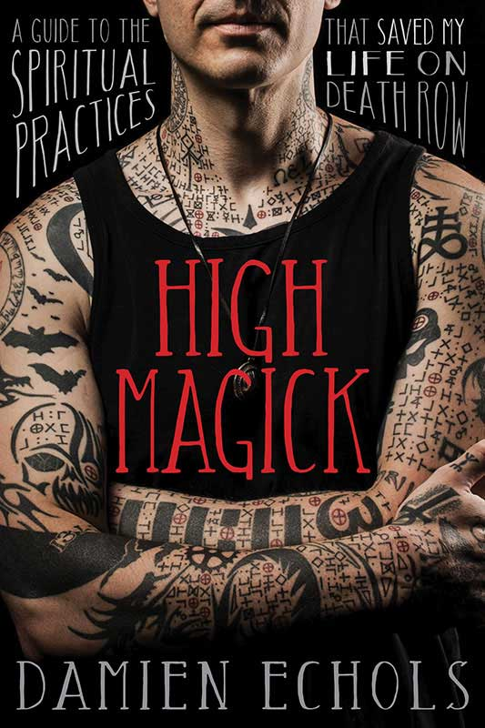

# Welcome!

My name is Jaime, and I recently fell into studying and practicing high magick. Coming from someone raised in the Lutheran church in Texas, I'm aware of how bizarre that may sound, but if life has taught me anything, it's that our parents weren't right about everything, and you have to look beyond the surface of something to discover what it is truly about. 

It all started when I watched [Damien Echols'](https://damienechols.com/) episode of [The Midnight Gospel](http://www.duncantrussell.com/midnightgospel-damienechols). Looking back, I could not tell you specifically what spoke to me about that episode, I just knew I had to look more into who Damien Echols is and the magick that he has dedicated his life to.

On July 17, 2020 I bought Damien's book, [High Magick](https://www.indiebound.org/book/9781683641346) and was completely unprepared for what I experienced. For most of my adult life, I would say that I have considered myself agnostic; aware that there is more to life than meets the eye, but closed off to the idea of placing any effort towards it because of what a letdown religion had been to me. However, I knew that if I wanted to have any meaningful engagement this book (as well as magickal spiritual practices as a whole), I had to be sincere and keep my skepticism at bay.

The rest of this entry highlight a initial life experience that has kept me open to sprituality, as well as the profound experiences I have had engaging with the practices that Damien has shared through his book. They are deeply personal, but I feel that having an open, honest dialog about these experiences will be helpful for me, and  potentially others as well.

## Texas Summer

It was 2005, and I was working at a college in the middle of nowhere Texas over the summer. A couple of friends and I were hanging out in the bed of a truck at their house smoking a fat joint, and the Milky Way was crazy enormous and bright in the night sky. We had some good tunes playing through the truck radio, and we were on one of those wavelengths where no one was talking, but everyone knew exactly what was going on with each other.

Next thing I knew, I started seeing my body get smaller and smaller beneath me as I floated up towards the stars. I reached a point where the Earth lay enormously stretched out before me, in the way it looks in pictures taken from the International Space Station. For a moment that felt like eternity, I gazed in awe at all of the celestial bodies surrounding me. I felt this extreme sense of calm and peace, and a realization that who we are and what were are meant for are in such opposition with the world we live in and the way our lives are structured. Once that realization hit, I started to slowly sink back down toward myself and in the back of that truck.

When I snapped out of it, I told myself that I would always try to keep that perspective and apply it throughout my life experiences. It's been a crazy, imperfect, and wonderful ride, and I am thankful to be a part of this experience. This is definitely among my favorite life moments.

## Ritual Experiences

Since beginning my practice and studies, I have encountered five noteworthy experiences that have stood out. I am capturing them here because they occurred at a time before I began keeping a ritual journal. These experiences have instilled in me an assurance that I'm on the right path and in the hands of great teachers.

### Lunar FourFold Breath Part 1

During this particular engagement with the Lunar FF, I ended up in a space where I was suspended between the Earth and the Moon. Brilliant silver light extended out from the Moon, blanketed me in its energy, and extended down to the Earth, tethering me in place between them. Toward the end of the meditation, I sank back into myself and ended the ritual.

### Lunar FourFold Breath Part 2

In this engagement, rather than being tethered between Earth and the Moon, I was in this forest that was full of pitch black trees. The gravity here was super light, and I was able to bound through it with extreme ease. I felt extremely care free and playfully happy. Then, I was struck with the notion of "What if I'm not the only one here?" It opened my mind to this entire realization of what it's important to call on protection from other entities and engage in magick in a safe place. It's entirely possible that there are sinister entities that could harm you. This whole experience reminded me of the naivety of children who have not yet learned to protect themselves from dangerous situations.

### Seasonal FourFold Breath

Following Damien's advice, I waited an appropriate amount of time before attempting the Seasonal FF, and my first experience was very powerful. It brought back to mind being a kid and what it was like to be active and enjoy various aspects of the seasons. Basically, how rewarding it is not just for our health, but for our mind and sense of gratification to be engaged with the Earth and its energy.

After this moment, the experience shifted to a quiet, unassuming room where I was seated on a sofa. On the coffee table directly across from me sat a snow globe containing a grove of trees on a hillside. The cadence of my breathing directly affected the progression of seasons within the globe. These cycles of life, growth, peace, and death inspired me to seek what will bring peace in this life so that death will not be in vain.

### Raising Energy

On the same day as my first Seasonal FourFold Breath (July 25, 2020 for posterity sake), I also engaged in my first experience of transfering energy into an object. I had been getting very good at being able to efficiently generate energy, then hold it in place and manipulate it without letting it dissipate. When I do this, it feels almost like a liquid magnetic pressure between my hands. When I pulse my hands in and out ever so slightly, I can feel the pressure of the energy compress and retract. When I slightly rotate my palms in opposing directions, I can feel the energy begin to rotate as well.

I worked my energy to this point of rotation, and as I felt the pressure pour into the object, I imagined the intention fo the object I had chosen, and the ways taht it will be able to enrich a path of healing and growth.

### Lunar FourFold Breath Part 3

During my nightly lunar fourfold breathing, following the period of drawing lunar energy, I remained in the meditative state and began pondering the nature of the HGA (Holy Guardian Angel). I had encountered brief reference to this being just a few times, and was considering all of the Biblical Old Testament depictions of God that I could remember. Was this the same being? What indication might I have to know where to seek them?

I suddenly felt a dramatic shift in the energy of the room. There was a huge, overflowing presence that froze me with a sense of fearful reverence. All I heard echo in my head was "Seek me, find me, know me." Then the presence was gone, and I ended my ritual.

## Closing

If you have read all of this, thank you for your time and care. This community, unlike so many I have engaged with both in real life and online, have been incredible to me so far. It is this sense of fellowship and encouragement that has inspired me to capture my work here. I look forward to continuing to learn and grow in this path, as well as cultivating great friendships with others within this community.