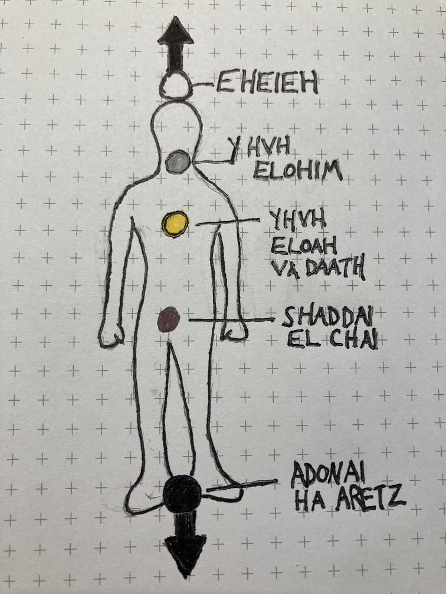

# Solar FourFold Breath

As I settled into visualization, I saw the 5 energy spheres of the Middle Pillar for the first time. I've been actively working towards memorizing the location, color, and phrase associated with each sphere, so I used that as a means of sinking into meditation. With each inhale, I would say a part of the phrase. Eventually, I reached a state where with each inhale, solar light flooded and cleansed the sphere corresponding to the phrase. At the end of this, I offered out a prayer. "Forgive me for the negative energy I have directed toward you in anger. I have been blind and ignorant, which has caused me to misguide my anger. I seek reconciliation ask for the strength and wisdom to stay the path, that I may achieve your purpose."

Below is my study card for the Middle Pillar:

Term | Pronunciation | Translation | Color | Representation
-----|---------------|-------------|-------|---------------
`Eheieh` | eh-hee-yay | I Am | Brilliant White | Higher Self Connected to Divinity
`YHVH (Yehowah) Elohim` | yay-ho-wah el-oh-heem | The Lord God | Pearly Gray | Link between Conscious Mind and Higher Self
`YHVH (Yehowah) Eloah Va Daath` | yay-ho-wah el-oh-ah va da-ath | Of Knowledge and Wisdom | Gold | Noonday Sun / Conscious Mind
`Shaddai El Chai` | shad-eye el kai | The Almighty | Purple | Subconscious Mind
`Adonai Ha Aretz` | ah-don-eye ha ah-retz | Lord of the Earth | Black | Physical Body