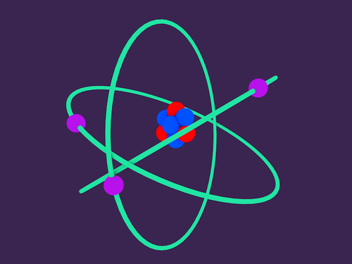
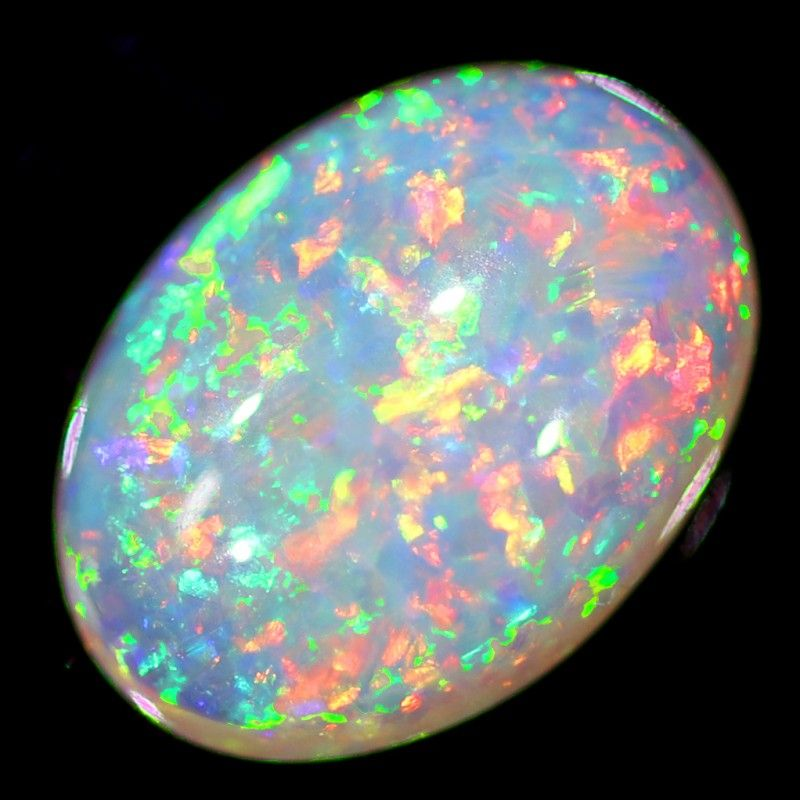

# Dreams

I awoke holding on to the phrase: need to help the world. I didn't recall anything else beyond that, but I was aware of the fact that I had dreamt. This is definitely progress.

# Solar FourFold Breath

My meditation this morning was relaxing and enjoyable. No strong visualization today, but I did find the very edge of a different state of consciousness. A state of mind on the border of awake and asleep. I wanted to sink further into it, but I had to get ready for work. This is definitely a place I need to explore further.

# Raising Energy

Today, I wanted to see if I could raise energy without having having to first generate friction. I simply placed my hands 6 inches apart, and felt the push and pull of energy flowing between my palms. Tensening up my hands and pulling them apart, I could feel the energy stretching as if I were pulling apart dough. My minds eye envisioned a need for courage and wisdom, so I charged my energy with these intentions, and immersed it into a mango wood disk that I have on my desk.

# Middle Pillar

Today's ritual felt distinctly different from both of my previous engagements. To sum it up, this energy felt more empowering and invigorating, as opposed to soothing and healing. Instead of my palms facing inward, I held my palms facing forward by my side. The visualizations during this experience were also very different. At each sphere, when I vibrated the mantras, I felt that energy swarming around me and weaving through my aura. It was as if my body were the nucleus of an atom, and the energy was orbiting around me like electrons. Also, the color of the aura permeated through mine and illuminated by perspective with its glow.

Whenever I connected to the Earth's energy, my whole aura burst (this is the best word I can use to describe it) and vibrated a brilliant white, but with the radiant color of an opal.

I felt the energy flow in and out of my hands, and they steadily rose until they were at chest level. I gave a thunderous clap to end the ritual. In this moment, I feel incredibly clear / sharp. I feel prepared to tackle anything.