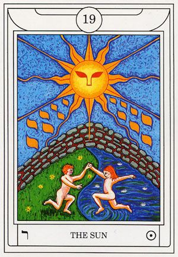

# Dreams

I was in a clean, modern village preparing for some abstract, important event. Everyone in the village that I encountered throughout the dream were people I know from previous phases of my life. Each sequence of the dream just consisted of conversations with different people in different moments. Everything felt calm and peaceful, almost too much so, and I got the impression that we were not in life on Earth any longer.

# Seasonal FourFold Breath

During todays Seasonal FF, I was laying under a grove of trees, watching their transformation synchronized to the rhythm of by breaths. WIth each passing of seasons, I grew more and mroe restless until I envisioned myself in action in each season. In spring, I was climbing rocks on a hillside. In summer, I was playing at a river bank, being refreshed by the cool of the water. In autumn, I was hiking trails under a blazing canopy of trees. In winter, I was gathering firewood in silent, magical woods blanketed with snow.

When I meditated on this following the ritual, I was saddened by the notion that these days, it's hard for people to even engage with the Earth anymore. Everything is either private property, or paid public land with hours, restrictions, crowds, etc. that make personal engagement near impossible. There need to be more public lands where people have the space and freedom to engage with life.

# Middle Pillar

This Middle Pillar ritual felt more like my first two engagements, but I feel like more was revealed this time. When I vibrated the mantras, I saw the "realm" of the energy contained in the spheres. The brilliant white sphere was the hardest to perceive, but it was the kingdom of divinity. Where everything is in perfect balance in the presence of God. The pearly gray sphere revealed a dream-like existence characterized by lunar silver, solar gold, and midnight blue. The golden sphere revealed what in my mind the Garden of Eden would have looked like. The purple sphere revealed a vast cathedral of wisdom, where the nature and secrets of existence are held. The black sphere contained the universe itself (as we understand it).

When the energy connected with the Earth's, I was free to peer into these realms to the degree that I was allowed to understand them, and saw each higher realm flowing from outside of the boundaries of each lower realm. Think of the same way as the Earth exists in space, but is also of space. After acknowledging this vision, I ended the ritual.

# Tarot Contemplation Ritual

My first ever interaction with the Tarot. I drew `19 - The Sun`.

* This card precisely calls to mind the vision I saw in the golden sphere in the Middle Pillar ritual today.

* Returning to the original intentions of existence.

* Fire, Wind, Earth, and Water are all represented in this card.

* Fulfilled (suns light) and protected (impenetrable wall) in the garden.

* Present as a being of both masculine and feminine form. Two bodies presented by one consciousness.

* **ﬧ** - Hebrew Resh depicted in the bottom-left.
    * Pictograph represents Head of a man.
    * Means Head, first, top beginning
        * Interesting as this is my first venture into the Tarot.
        * Could also be indicative of the first man, given the depiction of Eden?

# Raising Energy

I have come to realize just how important breathing is to raising energy. Additionally, it is important to align the energy points in the palms. I emit slightly more energy out of my push side than my pull side is drawing in. The degree to which I can control this is influenced by breathing. This allows me to fill a ball of energy, and control it based on how I influence its amount and vibration.

I'm going to aim for one of my energy work sessions each day to be an infusion into my newly acquired Tarot deck.