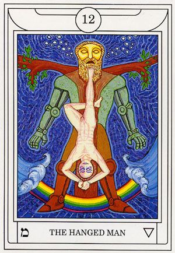

# Dreams

I did not recall my dreams when I awoke.

# Middle Pillar

Visualizations weren't very strong tonight, but the energy flow was intense. It felt like having a shower, but for my spirit. After connecting to Earth's energy, I held my left forearm at a 90 degree angle from my body (stretching it out in front of my). My palm was held forward, my hand down at a 90 degree angle from my forearm. My right plam was facing outward with my forearm at a 45 degree angle from my shoulder. I pushed energy out from within me, creating a vortex around my aura, and pulled the energy back in. When I felt cleansed, I ended the ritual.

# Raising Energy

My energy generation and control after Middle Pillar are outrageously higher than normal. I placed my hands 12" apart, and the magnetic pulsations in the energy ball were immediate and strong. Into my energy, I weaved insight and wisdom; an affinity towards divination. I then infused this energy into the Tarot.

# Tarot Contemplation Ritual

`12 - The Hanged Man`

* The statue appears to be that envisioned by Nebuchadnezzar in Daniel 2 of the Old Testament.

* Energy vibrates from the statue throughout the whole card

* **מ** - Mem represents water and chaos.

    * Perhaps alluding to an oncoming growth through adversity?