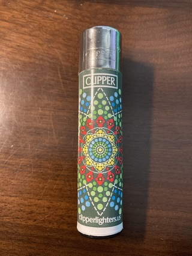
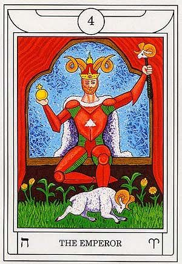

# Dreams

I was wandering the desert, following a source of energy. It lead me to a giant city in an oasis full of ancient wisdom and power. This became my home and my people.

# Solar FourFold Breath

When I sank into the meditation, I saw my five energy spheres emerge prominently within my body. When I inhaled, the solar energy streamed down into the radiant white sphere, down through the rest of the spheres. As I held my breath, the solar energy rotated around inside of the spheres, blending the energies. When I exhaled, all of the blended solar energy rushed out and circulated into my aura. As I held the exhale, I felt the electricity of my aura crackling at the fringes. In the end of the meditation, I spent a moment appreciating how lucky I have been to meet so many great people these past few years. I'm really starting to find joy in meaningful engagements with real people.

# Middle Pillar

The visualizations for the Middle Pillar today were centered around my body as a mountain. At each point, when vibrating the mantras, liquid energy erupted out of the sphere into a pool of energy below it. When connecting to the Earth's energy, the liquid energy overflowed so that each higher sphere fed into the sphere below it. As I experienced this, I felt the haziness of my consciousness clear, and my energy recharge.

# Raising Energy

I raised a roughly softball-sized energy ball, and wove into it the intent for motivation and leadership. I then infused this energy into my favorite lighter.

# Tarot Contemplation Ritual

`4 - The Emperor`

* Power, effectiveness, reason

    * Interesting that this would be what represents today's Tarot given what I sought in the above Raising Energy ritual.

* **ﬣ** - Heh, Window, Scarlet Red

* ♈ - Aries, Ram

    * Strong representation of Aries in this card, as indicated by:
        * The Ram

        * Ram horns in the Crown
        
        * Ram sceptre