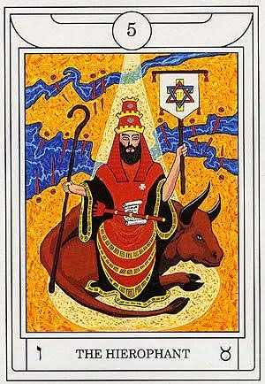

# Dreams

I entered into a cycle where an entire lifetime passed over the course of a day, yet my core being persisted beyond each day. I retained all of the growth and knowledge that ocurred over the span of that day. Ultimately, I gained the ability to traverse the Tree of Life.

# Solar FourFold Breath

Not a lot of visualization in my meditation this morning. Again, more of a sensitivity to the energies flowing around me. I noticed how clean and peaceful the aura is in my home office / ritual room now. It is a very welcoming, safe place for me to be in. I was attempting to reach into an altered consciousness, as experienced in previous rituals. Unfortunately, I ended up relinquishing a bit too much and ended up in a dream state of which I have no recollection.

# Middle Pillar / Raising Energy

Before I started the Middle Pillar today, I didn't know that I would close it by performing the Raising Energy ritual within the Earth energy connection. As the divine light cycled through my energy spheres, all I really experienced was strong energy movement. When I connected to Earth's energy, I just felt this thick surge cycling through me. I decided to try and channel this energy into my hands. The pressure of the energy ball was very high and had a very pure feeling to it. I didn't focus any intention beyond just feeling and controlling the energy shape, intensity, and momentum. I closed the ritual by infusing the energy into my Tarot deck.

# Tarot Contemplation Ritual

`5 - The Hierophant`

* Mercy and goodness, a person who shows these qualities
* **ו** - Vahv, Nail, Red Orange

* ♉ - Taurus, Bull

* Scarlet, gold, and blue dominate coloring

* The image draws to mind the land of Canaan from the Old Testament

* Red and gold wand sits atop a scroll in his lap

* Holding a shepherd staff in the right hand, and a banner in the left

    * Banner shows a red and blue hexagram overlaid on a golden cross with a white **T** inscribed

* Sitting on top of a bull

* Receiving divine light

# Lunar FourFold Breath

I think I may be exhausted. I need to pace myself a bit better in my growth, and I believe part of that comes from finding the right degree of involvement. This is an entirely new facet of you. Ease into it. Explore it. Don't burn yourself out in it. The excitement and shininess can tone down, and the true, well-paced work can take over. There will be more thrilling, breakthrough moments of growth and understanding. There will also be moments where you just have to give yourself room to reflect and grow. Consistency and dedication in the right dose. Time to get some rest and let myself refill the well.