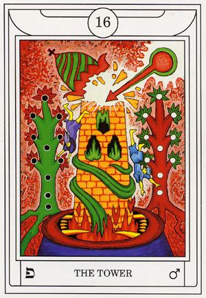

# Dreams

Five years from now, not only did I end up successfully finishing the project that I'm currently working on, my team ended up being recruited to do some really meaningful, intense work. The right people caught wind of what we are capable of, and carved out an entire segment of their tech section to accommodate our capabilities. In the dream, we had just finished a very difficult project for this customer, but our team had grown exponentially from when we started. I adopted a scaled out strategy for recruiting within and training new engineers to be able to contribute to our projects. A few of our friends that we know had already been integrated through this process. Our team had the freedom / leverage to do what was needed for our projects to get accomplished. At the end of this project, we were tasked by the government to create a new agency to be run as a tech company and our first initiative was to standardize and build out the recruiting and training processes that lead to our success.

# Solar FourFold Breath

My mind felt so at ease during the ritual today. It feels like the break I had last night gave me the appropriate time to digest all of the things my mind was chewing on. As I sank into meditation, I found myself laying in the grass on a clear summer day. The warmth of the morning sun radiated around me and I felt a clean connection to this energy. Once the energy connection reached full strength, I felt my consciousness detach and center between the Sun and my physical body. Where my consciousness rested, the solar energy poured through me and down to my physical body. After a few moments, the solar connection began to recede, my consciousness slowly settled back down into my body, and I ended my ritual.

# Tarot Contemplation Ritual

`16 - The Tower`

* Ruin, catastrophe, disruption

* **פ** - Peh, Mouth, Scarlet Red

* ♂️ - Mars, Horse, Bear, Wolf

* Scarlet Red, Green, Blue dominate coloring

* Tower is flanked on both sides by the tree of life, but the tree on the left side has an additional Sephira at the bottom.

* A person is falling from the tower on either side.

* Energy from above has destroyed the top of the tower.

* Green flames engulf the mid-section of the tower.

* The tower is being devoured by a mouth at its foundation.

* Flames engulf the tower from the opening of the mouth, and it is wrapped with a green tongue.

* Tower of Babel from the Old Testament
    * Structure built in the land of Shinar (Babylonia) some time after the Deluge. The story of its construction, given in Genesis 11:1-9.

* This card gives me a great sense of unease. It gives me the sense that I should be very careful in my communications and not try to shake things up too much.

I wanted to revisit this contemplation, because it left me with a great deal of uncertainty as to the accuracy of my initial feelings. For the first time, I wanted to take in an [external perspective](https://labyrinthos.co/blogs/tarot-card-meanings-list/the-tower-meaning-major-arcana-tarot-card-meanings) regarding this card. This is what really hit home and made this a much more meaningful draw for today:

> The Tower represents change in the most radical and momentous sense. It is for this reason that the card itself visually looks so unnerving. But it doesn't necessarily have to be truly frightening or ominous. Because at the heart of this card, its message is foundational, groundbreaking change.
>
> The kind of event that the Tower card marks does not have to be something terrible, like a disaster or a great loss. Change itself is a normal part of life that one has to embrace. But it can sometimes strike fear, for it means that we must abandon the truths that we have known prior to this event. The old ways are no longer useful, and you must find another set of beliefs, values and processes to take their place.

Contemplating the Tower in this light, it makes absolutely more sense. To say that I've been able to completely rid myself of internal bias or expectation since the start of my journey in magick would be a false statement. It's extremely hard to uproot years of religious indoctrination. Particularly where an eternity being tortured is concerned. However, I need to recognize this for what it really is: fear on the basis of a religion manipulated to control minds.

As my deeper research suggests, "The old ways are no longer useful, and you must find another set of beliefs, values and processes to take their place." To that end, I will re-align my approach and thoughts to this ultimate boundary: 

* If something is pure and good in nature, I will adopt it.
* If something is gray but leads to good, I will adopt it.
* If something is gray but leads to evil, I will refuse it.
* If something is wrong and evil in nature, I will refuse it.

Apart from the above, there will be no more expectation, and I will be performing the Charging Water ritual again in just a moment to cement these intentions into my psyche.

# Middle Pillar, Charging Water, and Programming Water

Given the illumination from my revisiting of the Tarot Contemplation Ritual above, I decided to perform a more involved ritual to really influence deep transformation and to signify my commitment to the path of high magick. I started by performing a full Middle Pillar while holding the glass of water. At the activation and vibration of each energy sphere, the visualization and flow of energy was very strong and stable, and I made sure to take my time allowing Divinity to flow down the pillar.

When I connected to the Earth's energy, I performed a FourFold breath facing North. I then performed a left face (in military drill and ceremony, this is a way to smoothly transition the direction your body is facing 90 degrees to the left) and performed a FourFold breath facing East. Another left face, and a FourFold breath facing South. Another left face, and a FourFold breath facing West. Another left face, and I performed 5 iterations of inhaling energy into the golden sphere from Divinity above and Earth below, then exhaling the energy out of the golden sphere, through my palms, and into the glass of water.

I took a deep breath and visualized the golden energy radiating in the glass between my hands then exhaled. I took another deep breath and vibrated the thought-form "May the light protect, guide, and illuminate me on my journey through life and on the path of high magick." I took another deep breath and in a loud, resounding voice vibrated **Yeshua**. I then sipped all of the water from the glass and as I exhaled, visualized the energy filling every crevice of my being. I ended my ritual with a vibration of **Amen** and a clapping of hands.