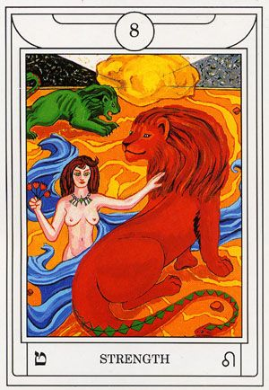
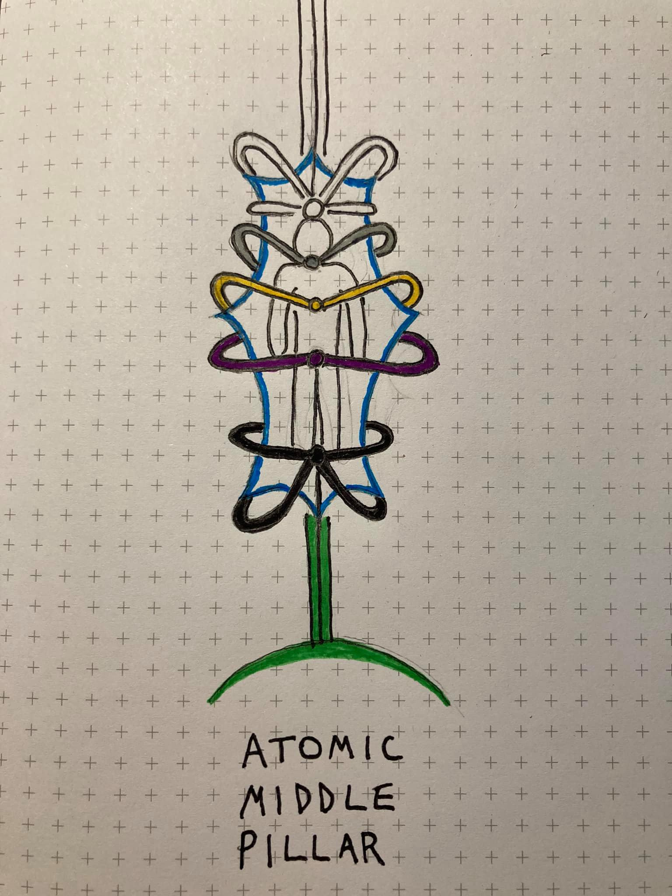
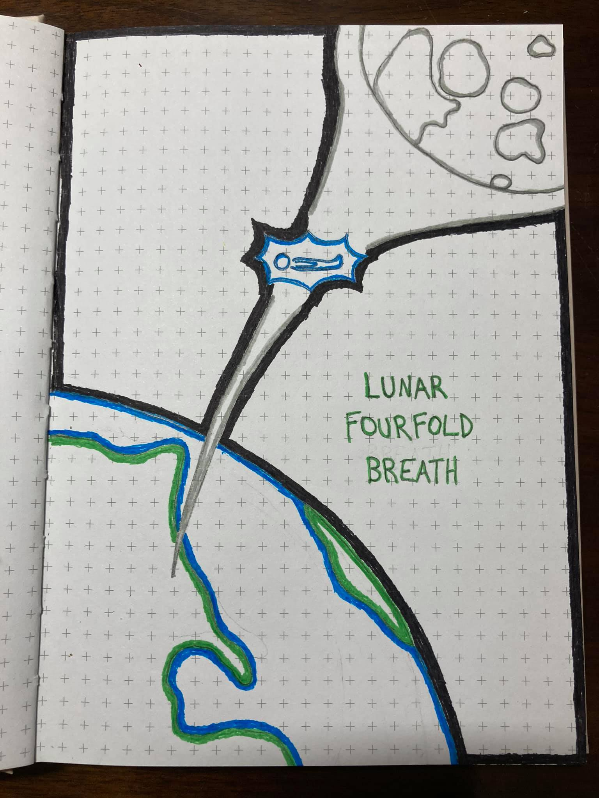

# Dreams

We allow our cats to spend time outside, and from time to time, they like spending the night out. Jasper, my more wild-natured cat, has been gone since Thursday night and it is not normal for him to be gone so long. Last night, in my sleep, I felt his presence as if he were curling up to me in bed. I don't know what has happened to him, but I'm of the mindset that if he wanted to be home, he would have come home. I also don't want to go looking for him too hard, because I would rather not find out if something terrible happened to him. For all I know, he has found a more natural life fitting of his wilder nature. Unless he shows back up at this point, I will believe that he's still out there living his best life on the prowl.

# Seasonal FourFold Breath

There's a theme that has been heavy on my mind throughout this meditation, spawned by a conversation with a friend. How do we live in harmony with the world while still advancing as a species? The Earth will not be able to sustain itself with the way we have been ravaging and polluting it. I believe the answer lies in restoring a spiritual connection to our home. If a technology or practice is unsustainable, it should not be permitted.

We're at a point now in our technological development where we could sustainably automate all of our essential needs for survival. We can intelligently build supply lines and communities that limit the ecological impact we have on the world. This will never happen unless we can redefine as a species what is valuable. As it stands, material wealth and personal gain are the pillars of ambition. We need to shift our values towards community, humanity, and being good stewards of our home. Then, instead of worrying about surviving financially from month to month, we can focus on thriving together and optimizing the extent to which people can realize their potential.

# Raising Energy

Immediately following the Seasonal FourFold ritual, I sat at peace, filled with a sense that with the right dedication, everything will be okay. In this moment, I created an energy ball infused with the aspects of who I am. My values, desires, fears, joys, all of it. The current state of my energy as influenced by all of my life experiences to this point. When the energy ball was stable and powerful, I infused it into my Tarot deck.

# Tarot Contemplation Ritual

`8 - Strength`

* Spiritual power

* **ט** - Teht, Serpent, Yellow (Greenish)

* ♌ - Leo, Lion

* I drew this card directly after my contemplation during the Seasonal FourFold Breath and after infusing my energy into the deck. As soon as I saw the card, a smile came across my face. There was something about the energy it held, in conjunction with the energy I was feeling from my contemplations, that felt very complimentary. It was almost as if the card was telling me, "You're really starting to get it. Now you will need the strength to persevere."

* The card depicts a red and green lion, each of which have a serpent for a tail. There is a woman wrapped in blue energy that has tamed the red lion. I find this meaningful because strength is not depicted as violent. Rather, it is depicted as harmonizing energy in the presence of powerful beasts.

* My intuitions about the card seem to be confirmed upon looking at an [external perspective](https://labyrinthos.co/blogs/tarot-card-meanings-list/strength-meaning-major-arcana-tarot-card-meanings):

> In this tarot card, you see a woman who calmly holds the jaws of a fully grown lion. Despite the fact that the lion looks menacing and strong, the woman seems to have dominion over it. What is captivating is how gracefully she controls the lion. She is calm and collected, which is representative for being in control and disciplined especially in times of great adversities.
>
> When you get the Strength card in an upright manner during your tarot reading, then it shows that you have inner strength and fortitude during moments of danger and distress. It shows that you have the ability to remain calm and strong when your life is going through immense struggle. It also shows that you are a compassionate person and you always have time for other people even if it's at your own expense.

# Notes

I was in the midst of settling into the Lunar FourFold Breath, and I got REALLY close to reaching that state where the body falls asleep, but the mind remains. [Ioanna Gika](https://open.spotify.com/artist/4ctIi0Pt6FzHjDUD7CU2os?si=_GzZA00ATWudGMCG4_slcA) was playing in my mind, and I could feel all of my energy sharply vibrating around me. The vibrations began to match the energy of the music, and I started to see the places composed of this energy. Unfortunately, I think I was just a bit too tired, and ended up completely falling asleep.

Additionally, I've been spending some time getting reacquainted with drawing. The nature of the visualizations I've been having have been so intense, and after being inspired by a good friend, I decided to try to replicate these experiences. Below are representations of the Atomic Middle Pillar (so called for the feeling of energy swarming like electrons), and the place I often find myself when engaged in the Lunar FourFold Breath:

