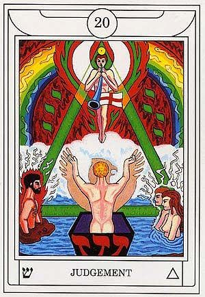

# Dreams

Yet again, I entered a half-state of consciousness and felt my cat Jasper's energy in the room. I hope he's out there living his best life.

# Solar FourFold Breath

In High Magick, I remembered Damien talking about performing this ritual while riding the subway. I live in a quiet neighborhood that doesn't have a lot of activity, so I decided to engage in the Solar FourFold Breath while walking my dog. It was near noon, and the sun was extremely bright and radiant. Under other circumstances, I probably would have found this intensity oppressive and overwhelming, but today, I welcomed the energy it offered. It was weird, because I felt as much as my dog was tethered to his leash, I too was tethered to the energy of the sun bathing me. In its glow, I felt it melting away my lingering feelings of apathy, laziness, anxiety... really anything that would stand in the way of actively engaging with life. I came back in from my walk feeling incredible. I definitely need to do a Solar FF drawing soon.

# Middle Pillar

For this ritual, I decided to sit zazen rather than standing. I have these pillows shaped like right triangles that are perfect for this pose. When I got into meditation, I felt the energy a lot stronger and cleaner than usual. This also allowed me to visualize and influence its flow a lot easier.

I saw myself on a flat, grassy plain at the top of a cliff overlooking the ocean. The sky was gray with clouds, but when I focused on teh brilliant white divine energy, a large circle of sky cleared overhead, and the beam struck down and began the energy sphere flow. After vibrating each mantra, the spheres radiated shafts of energy in all directions. When I connected to the Earth's energy, I felt in full control of its flow, so I decided to practice the Circulating Energy ritual.

# Circulating Energy in Middle Pillar

When I inhaled, the energy rose to the brilliant white sphere, and when I exhaled, it shot out of the top like water shooting out of a fountain and flowed down my left side. When I inhaled again, the energy rose to the top again, and when I exhaled, this time it flowed down my right side. I performed this iteration one more time on each side before changing the flow to front and back. I ran through this sequence for two iterations (allowing energy to flow twice in down the front, and twice down the back). I finished the ritual by performing four iterations of inhaling a twisted spiral of energy, and exhaling this spiraled energy into a stream that flowed down and all around me in this spiraled shape.

# Raising Energy

While still sitting zazen and connected to the Divine and Earth energies, I generated a large (roughly a half meter across) energy ball. The energy was a blend of Divinity, Earth, and my own energies. In it, I infused properties of healing as well as protection from illness and injury. I programmed into it magnetism towards the energy of my friend who I intended it for. Placing my palms flat against the ground, I poured all of the energy into the Earth energy stream. My friend is going to draw it out through the Middle Pillar here soon.

# Tarot Contemplation Ritual

`20 - Judgement`

* Renewal, rebirths

* **ש** - Shin, Tooth, Glowing Orange Scarlet

* Triangle symbol literally means Fire; Lion

* The same day that I drew this card, the gentleman my girlfriend works for as an in-home caretaker passed away.

* Also interesting that symbols of new beginnings continue to shine prevalent at this stage of learning and practicing magick.

* A being is levitating and blowing a trumpet. They are surrounded by a red, green, and white aura in the shape of wings. There is a yellow sphere with a black dot in the center of it placed just at the top of the being's head. Green energy descends from the circle down to the right and left side of a river below, and connects to form a triangle. On the left side, the energy is directed at a man surrounded by a red aura and white sparks shooting out of the aura. (Lucifer?). On the right side, the energy is directed at a man and a woman with white-translucent auras and white sparks shooting out from the aura (Adam and Eve?). Between them in the foreground, there is a man with an aura shaped like an Eagle raising his hands before the being with the trumpet. In the background, a rainbow with serpents flowing up towards the center on either side sits in front of a backdrop of crimson flames. At the horizon stretches a stream of white clouds.

* An [external perspective](https://labyrinthos.co/blogs/tarot-card-meanings-list/judgement-meaning-major-arcana-tarot-card-meanings) of the card reveals:

> The card depicts what one would imagine the last judgment would be, in the various forms that takes in many mythologies. The image in the Judgement card shows women, men, and children who are rising from the grave to respond to Gabriel's trumpet call. Their outstretched arms symbolize that they are ready to be judged by the universe. They are about to meet their creator, their actions weighed, and find out where they will spend the remainder of eternity: in heaven or in hell. The massive tidal wave in the background signifies that judgement is unavoidable, and that this judgement will be final.
>
> The traditional Judgment meaning focuses on the moment when we reflect and evaluate ourselves and our actions. It is through self-reflection that we can have a clearer and objective understanding about where we are now, and what we need to do in order to grow as humans. The Judgement card appearing in a reading signifies that you are coming close to this significant point in your life where you must start to evaluate yourself.
>
> To see this card can also indicate that you are in a period of awakening, brought on by the act of self-reflection. You now have a clearer idea of what you need to change and how you need to be true to yourself and your needs. This can mean making small changes to your daily life or making huge changes that not only affect you but the people close to you.