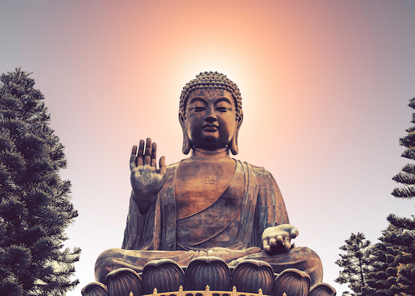

# Dreams

In my sleep last night, I found myself looking out at reality and initially seeing it through my human perspective. However, the longer I looked, the more I started to see the particles and energy individually and in action. Photons piercing the void and giving definition to the atomic structures interlocked together by gravitational attraction. In all of this, I saw the energy as streams shaped from divinity and lost sense of physical existence.

# Middle Pillar and Raising Energy

As I settled into meditation, I found myself entering the temple contained inside of the golden sphere. I discovered this temple while performing the guided Radiant Divine Breath during Damien's recent live stream. Within it, I sat zazen at the center of my consciousness and directed the Divine energy through my spheres. My physical body stood tall and still, a universe unto itself. When vibrating each mantra, I felt a swarm of energy around each sphere; the kind of swarm you see from flying insects.

When I connected to Earth's energy, I placed my hands in a push / pull position. Right palm facing out, left palm facing up as seen in depictions of the Buddha. I felt the energy vibrating against me, similar to the electric feeling that causes the hair on the back of your neck to stand. At that point, 5 energy spheres appeared in a circle around the chest of my conscious body in the temple. They swirled around slowly, and began to raise and lower cyclically. The power and clarity of the energy was absolutely immense.

My physical body, while still connected to this energy, sat cross-legged and began an intense raising energy ritual. I felt called to form and infuse energy for three friends today. In each case, I generated energy from the orbiting sphere wave around my conscious body, infused it with the intent I felt needed for each friend, and directed it into the Earth with a mantra for each.

* The first energy ball: `YHVH, send this blessing`

* The second energy ball: `Yeshua, send this blessing`

* The third energy ball: `Adonai send this blessing`

After all of the energy was sent, I closed the ritual with the mantra: `for the glory of your Kingdom. Amen.`