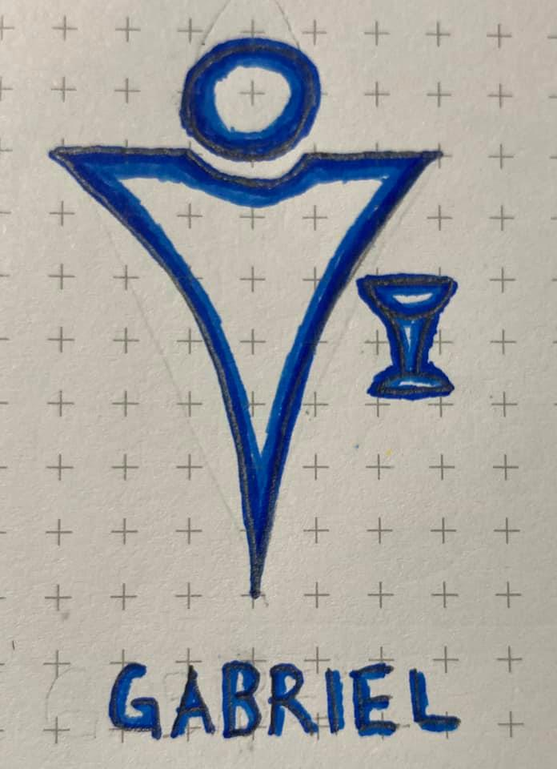

# Qabalistic Cross 
# Lesser Banishing Ritual of the Pentagram
# Middle Pillar
# Qabalistic Cross

> All of the above rituals were performed in sequence during as a singular ritual.

Today, I was intent on practicing the Qabalistic Cross ritual for the first time. I was very comfortable and familiar with the steps in my mind, so I captured the notes for the full Lesser Banishing Ritual of the Pentagram in the event I felt called to perform it. In my mind, I told myself that I would only go as far as I felt comfortable.

I ended up performing the whole series, with a Middle Pillar before teh final Qabalistic Cross. I'm not going to recall all of the steps here, but rather the feelings and visualizations from teh experience.

When invoking the archangels, I definitely felt their energy and saw them emerge around the circle of pentagrams. They stood facing outward on the outside of each pentagram. Metatron, facing east, hovered above me looking upward. Sandalphon, facing west, was beneath me facing downward.

After I closed the sphere, we emerged at a courtyard at the top of a tower overlooking creation. Pillars were anchored to each corner, and a circular ring connected them all about 10 feet overhead. Directly above the ring lay the barrier to the three veils from which the divine light originates. I felt a presence watching over me within the courtyard, though I could not see them. I could only feel their energy, an energy full of love and nurturing.

As I performed the Middle Pillar, I felt this presence infusing their energy into each movement. After circulating the energy into the fountain, I felt guided to generate a large energy ball full of an equivalent amount from all sources. When the vibration of the ball was immense, I was led to cast it upward and shower it down onto reality below. The energy was full of peace and spiritual awakening.

After the Middle Pillar, I rose to my feet and closed out the ritual with a final Qabalistic Cross. When complete, I clapped my hands and felt tingling and vibrations all around my body. I felt empowered in a way that I have never felt before in my life. I'm still curious who the entity at the top of the tower was. It was very much distinct from the archangels protecting the sphere, and it was able to engage with my energy from within the safety of the sphere.

# Notes

My partner got sideswiped on the highway about 30 minutes after I finished the above ritual (I was in the middle of drawing the Gabriel representation above when I got the phone call). No one was injured, someone was just driving recklessly in the rain. On my way to pick her up, I was feeling really uneasy. It was pouring down rain and dark outside, so I was bare knuckling the steering wheel keeping it together. Then I felt the presence from the Middle Pillar in the truck with me. All of my anxiety dissipated and I felt a huge sense of relief. I really need to find out more about this presence.