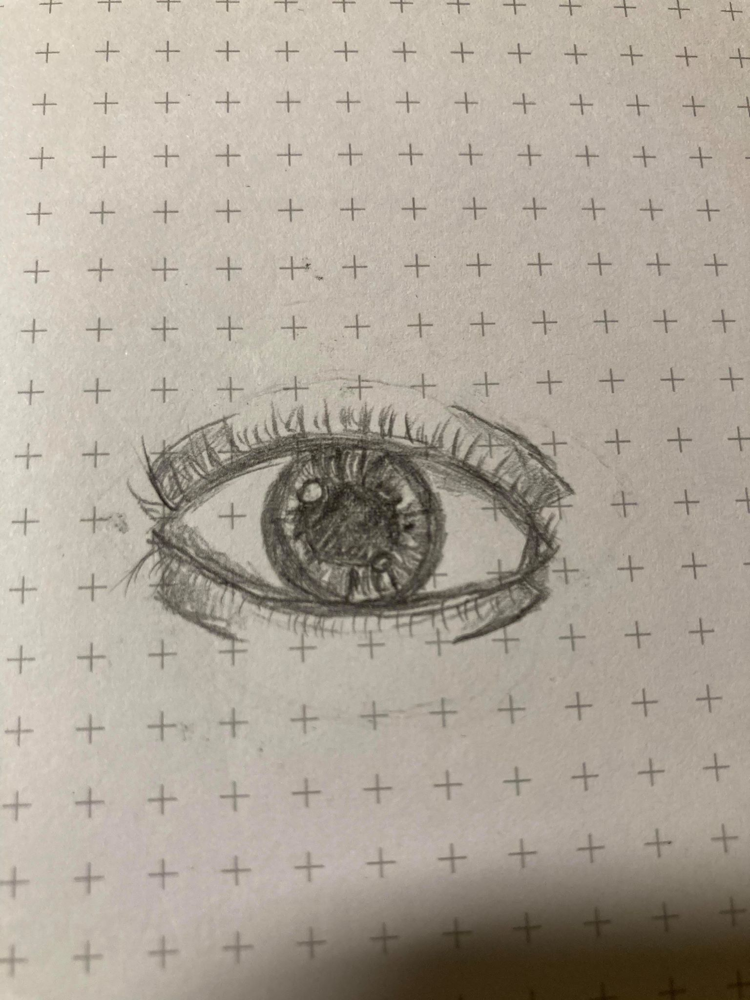

# Songs

**Anjie's Songs**

* [Periphery - Marigold](https://open.spotify.com/track/2TnB5UKg5hbNsmG2YfyaBd?si=xqSR3OK2QIe4eV22memF_g)

**Jaime's Songs**

* [Unearth - Black Hearts Now Reign](https://open.spotify.com/track/3db8XSoeXxssrgoaGW7IQo?si=-NJ3ar47QwCmiORdfH3scQ)

# Notes

This week has just been so draining and negative. I had every intention of performing the LBRP, but completely passed out in my pre-ritual meditation. Note to self, if starting ritual past 9, just forego the meditation and go for it. While everything has felt oppressively negative, the silver lining is that I'm handling it in stride and not allowing it to turn me negative. I'm just able to recognize the negativity, and ride it out. On another positive note, I was instructed in how to draw an eyeball, and spent about an hour engaged in that. I feel like I need better pencils so I can actually do shading (grocery store mechanical pencils are kind of shit for drawing), but Anjie says it is good.

