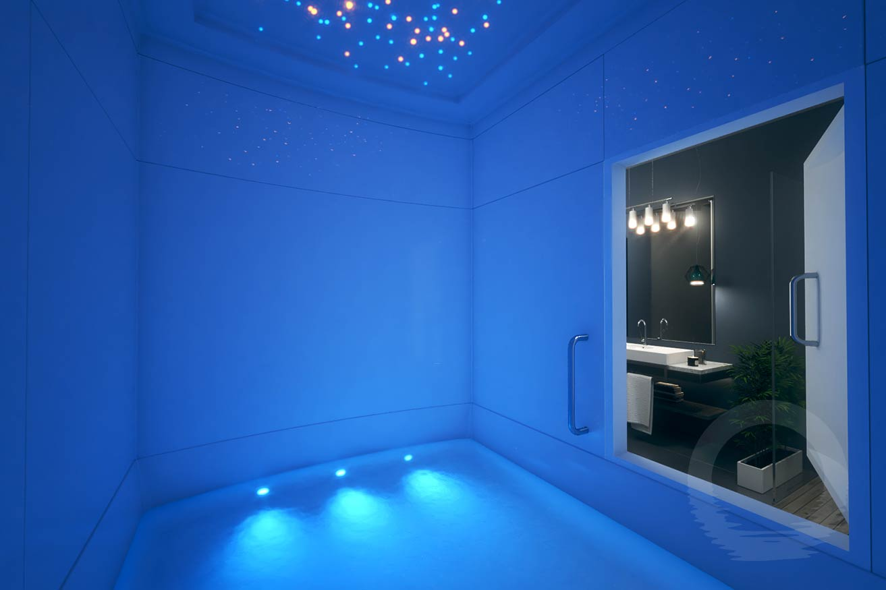

# Float Tank / Middle Pillar

I turned all of the lighting and sounds off in the immersion tank. After I settled in and found my center, I was feeling really crazy vibrations on the surface of my skin around my whole body. It was a really uneasy sort of vibration, but I pushed through my initial feelings of anxiousness and performed the middle pillar.

During the middle pillar, my conscious body was levitating in the tower courtyard I encounter during LBRP, tethered above by the divine energy. When I connected to the Earth’s energy after charging all of the energy spheres, I felt the uneasy vibrations begin to break loose.

When I got to energy fountain, all of it was shaken out of me, and I felt a huge sense of burden relieved from within me. It felt like a higher state of consciousness, and I felt centered in a way that didn’t have a tangible physical anchor, more in the sense of my consciousness was centered with the divine consciousness.

At this point, I lowered back into my body and allowed myself to just feel and be present in the moment. I ultimately felt compelled to raise an energy ball. It took me a moment to find the polarity to begin forming it, but when I did, it was a super thick, rich energy. I probably spent an entire 5 minutes working with it, pushing different pressures, expanding it, intensifying its natural rotations. When it felt complete, I just blasted it out into the universe above me.

When I settled down from that, I found myself present and floating again. I reached a stage of consciousness where I let myself know that if I wanted to leave, that was okay. So my conscious body stepped out, and again, I found myself at the tower courtyard, only this time, there was now a passage into the area directly below. When I went into it, the tower presence told me, “you have awakened a new level of consciousness and are now granted access to this segment. Now that you know how to get here, you can come here anytime you want, so just enjoy it for now.” So for the rest of my time there, I explored this labyrinth of corridors that would occasionally open up to different rooms. I didn't really notice much detail about the rooms, beyond that they seemed to be places to dwell and have different experiences. Each room had its own vibe and coloration.

When the experience was over, I emerged from the tank in a very calm and euphoric sort of state. I rinsed off and went to have dinner with some great friends. I definitely need to reflect more on the labyrinth that opened up in the tower in future rituals. If anyone is on the fence about experiencing the float tank, I couldn't recommend it higher.